# Teams Requests
Custom Microsoft Teams creation process using SharePoint Online and Microsoft Flow that allows for additional metadata to be collected during the request, enabling organizations to implement their governance requirements while still allowing automated self-service.

Employees will fill out a request form in SharePoint Online (or in PowerApps, should you choose to create one). A Flow will trigger on that new SharePoint Online item and use the Microsoft Graph API to create a new team based on the selected template, assign the requested owners, and notify the requester with a Teams notification.

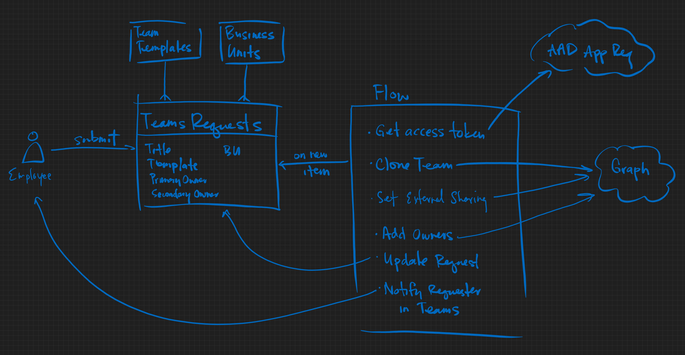

## Steps
1. [Register an Application in Azure Active Directory](#register-an-application-in-azure-active-directory)
2. [Create SharePoint Online Custom Lists](#create-sharepoint-online-lists)
3. TODO: Create a Site Design for restricting guest access in SharePoint
4. [Create a Power Automate flow](#create-power-automate-flow) OR [Import the flow](#or-import-the-power-automate-flow)
5. [Create a PowerApp](#create-powerapp)
6. [Pin the app to the sidebar in Microsoft Teams](#publish-powerapp-to-teams-and-pin)

## Register an Application in Azure Active Directory
1. Browse to https://aad.portal.azure.com
2. Register a new application: https://portal.azure.com/#blade/Microsoft_AAD_RegisteredApps/ApplicationsListBlade
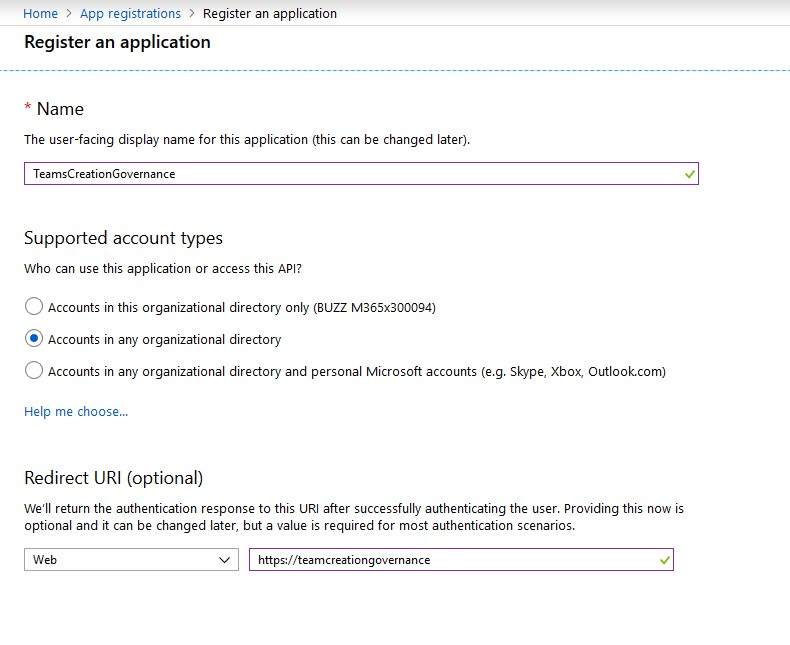
3. Copy the `Application (client) ID` and the `Directory (tenant) ID` from the Overview page into OneNote/notepad
4. Click on `Certificates & secrets` and create a new client secret (copy/paste it into OneNote/notepad)
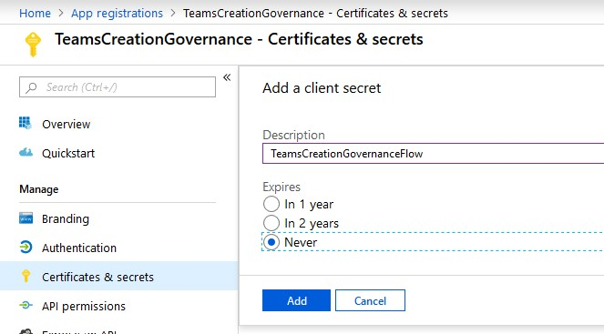
5. Click on `API permissions` and add the following permissions for Microsoft Graph (Application, not delegated): **Group.ReadWrite.All**, **User.ReadWrite.All**, **Directory.ReadWrite.All**
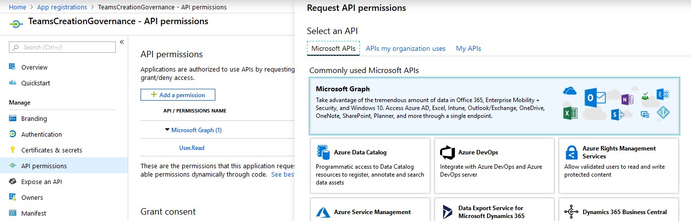
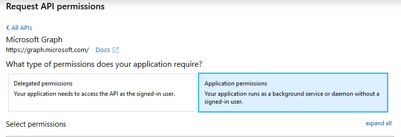
6. Click the `Grant admin consent for [tenant]` button

## Create SharePoint Online lists
The following custom lists in SharePoint are used in the sample Flow and can be modified/omitted to fit your needs. Any alterations may require updates to get the Flow to work, depending on the change.
### Teams Templates
Create teams in Microsoft Teams to act as your templates, then store references to those templates in this simple custom list to be chosen from when someone requests a new Team. This list will be used as a lookup on the Teams Requests list. You can copy/paste the TeamID from the Teams Admin Center.
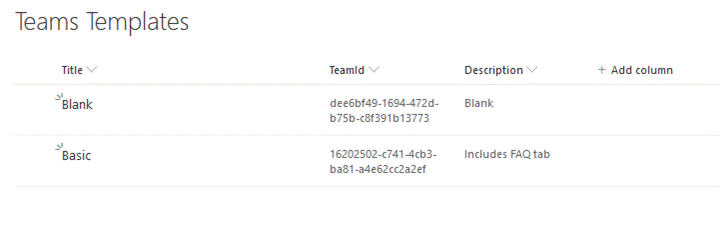
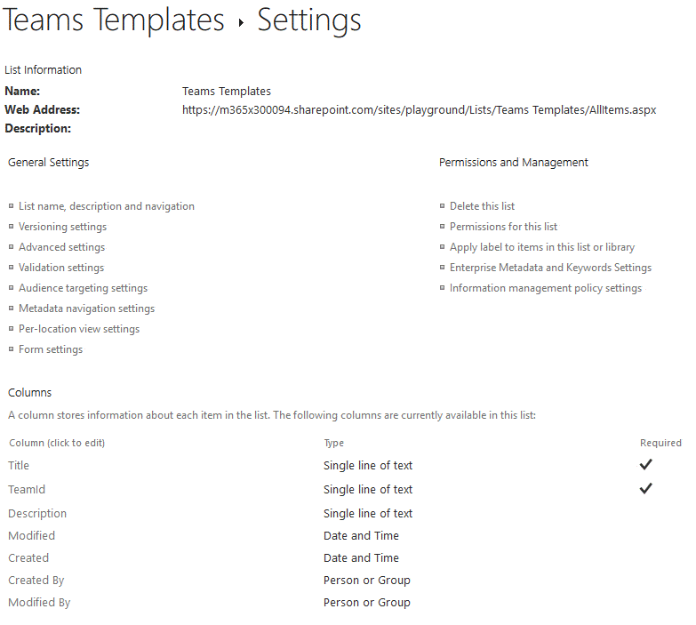
### Business Units
This custom list (with no additional custom fields) is entrirely optional and just an example of the type of extra information you can collect and store to meet your governance needs. This list will be used as a lookup on the Teams Requests list. 
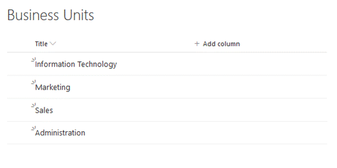
### Teams Requests
This custom list is where people will submit their requests. You can certainly make a PowerApp on top of this list for people to use.
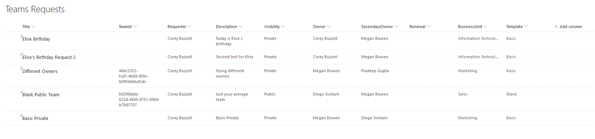


## Create Power Automate flow
*Or you can import the flow in the [step after this](#or-import-the-power-automate-flow) and update the various actions. I recommend importing the flow with some emporary name, then creating a new flow that will be the real one, so you can follow along and copy/paste things from the imported flow.*

1. Browse to https://flow.microsoft.com

2. Click on `Create` in the left menu

3. Start from blank: `Automated flow`

4. Give your flow a name and choose your flow's trigger: `When an item is created (SharePoint)`, click `Create`

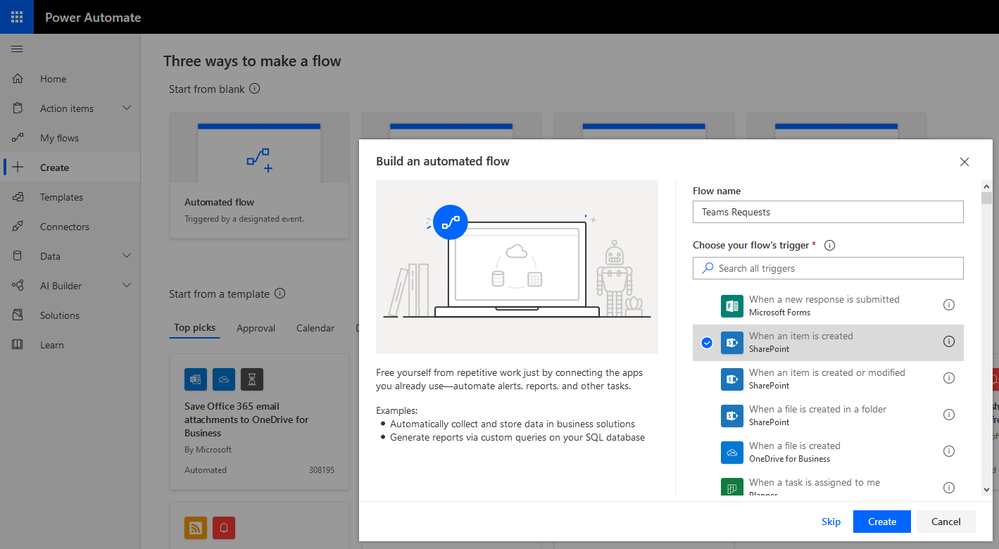

5. Select the Site where you created the lists above and select the List Name to: `Teams Requests`

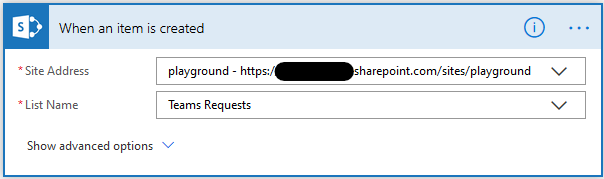

6. Add 3 new steps using the `Initialize variable [Variables]` action for each, setting the Values to the IDs you copied when you created your AAD App Registration above

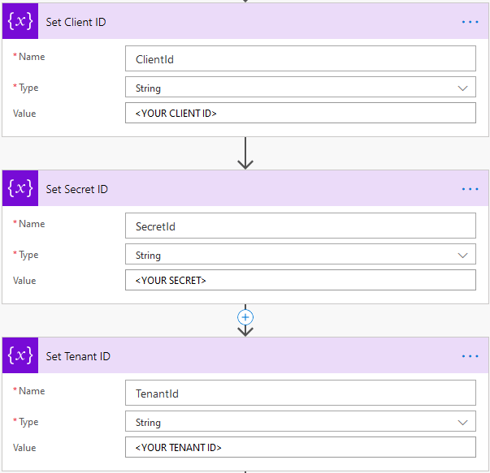

7. Add 3 new steps using the `Initialize variable [Variables]` action for each, setting AllowGuests to the expression:
```
if(triggerBody()?['AllowGuests'], 'True', 'False')
```

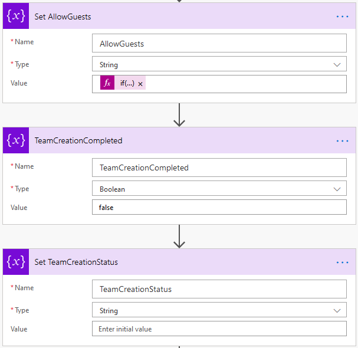


*Note: this would be a good point in the flow to trigger an Approval if Guest Access is requested, if this meets your business needs. Just add a `Condition` to check if `AllowGuests` is `true`, adding the relevant Approval actions in the `True` path, with all that follows coming after the `Condition` action.*


8. Add a new step using the `HTTP [HTTP]` action. The is the first of several HTTP calls. This one will get the bearer token we need to call the Graph later.

Method: POST

URI: ```https://login.microsoftonline.com/@{variables('TenantId')}/oauth2/token```

Body:
```
client_id=@{variables('ClientId')}&
client_secret=@{variables('SecretId')}&
grant_type=client_credentials&
resource=https%3A%2F%2Fgraph.microsoft.com
```

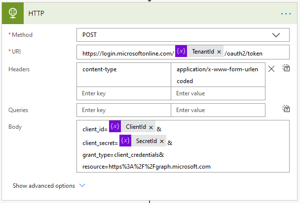

9. Add a new step using the `Parse JSON [Data Operations]` action, seeting the Content to the HTTP action `Body` and the following schema:

Content: ```@{body('HTTP')}```

Schema: 
```
{
    "type": "object",
    "properties": {
        "token_type": {
            "type": "string"
        },
        "expires_in": {
            "type": "string"
        },
        "ext_expires_in": {
            "type": "string"
        },
        "expires_on": {
            "type": "string"
        },
        "not_before": {
            "type": "string"
        },
        "resource": {
            "type": "string"
        },
        "access_token": {
            "type": "string"
        }
    }
}
```

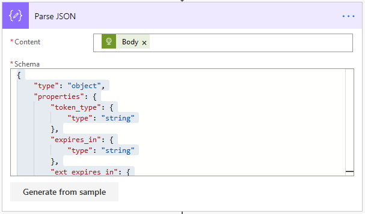

10. Add 2 new steps using the `Get user profile (V2) [Office 365 Users]` action to get the Owner and Secondary Owner profiles using the trigger `Owner Email` and `SecondaryOwner Email` fields

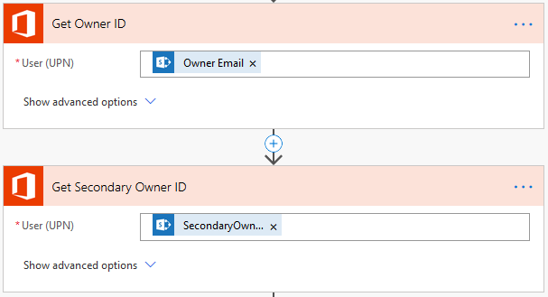

11. Add a new step using the `Get item [SharePoint]` action, selecting the `Teams Templates` list and the `Template Id` from the SharePoint trigger

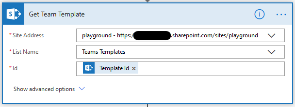

12. Add a new step using the `HTTP [HTTP]` action (notice the space in between Bearer and the access token in the Headers)

Method: Post

URI: ```https://graph.microsoft.com/v1.0/teams/@{body('Get_Team_Template')['TeamId']}/clone```

Headers: Authorization: ```Bearer @{body('Parse_JSON')?['access_token']}```

Body:
```
{
  "displayName": "@{triggerBody()?['Title']}",
  "description": "@{triggerBody()?['Description']}",
  "partsToClone": "apps,tabs,settings,channels",
  "visibility": "@{toLower(triggerBody()?['Visibility']?['Value'])}",
  "mailNickname": "@{triggerBody()?['Title']}"
}
```

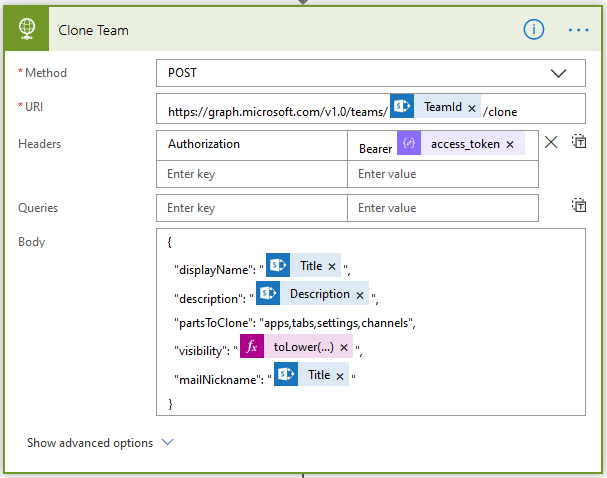

13. Add a new step using the `Parse JSON [Data Operations]` action, seeting the Content to the `Clone Team` action `Headers` and the following schema. Here we go, let's create the team.

Content: @{outputs('Clone_Team')['headers']}

Schema:
```
{
    "type": "object",
    "properties": {
        "Transfer-Encoding": {
            "type": "string"
        },
        "request-id": {
            "type": "string"
        },
        "client-request-id": {
            "type": "string"
        },
        "x-ms-ags-diagnostic": {
            "type": "string"
        },
        "Duration": {
            "type": "string"
        },
        "Strict-Transport-Security": {
            "type": "string"
        },
        "Cache-Control": {
            "type": "string"
        },
        "Date": {
            "type": "string"
        },
        "Location": {
            "type": "string"
        },
        "Content-Type": {
            "type": "string"
        },
        "Content-Length": {
            "type": "string"
        }
    }
}
```
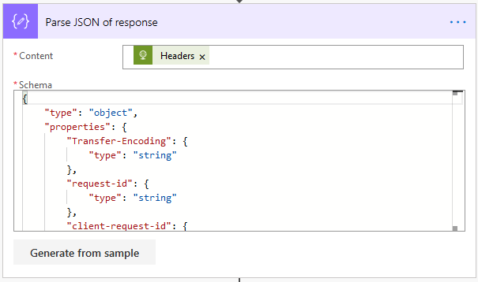

14. Add a `Compose [Data Operations]` action, setting the inputs to the expression: ```substring(body('Parse_JSON_of_response')?['Location'], 8, 36)```. This will get the ID of the Team we just created to use later.

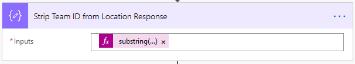

15. Add a `Do until [Control]` action for when the TeamCreationCompleted variable is equals to true. This is where we confirm that the Clone Team operation has completed successfully. Count: `10`. Timeout: `PT45S`. Check out [this blog post](https://www.o365recipes.com/microsoft-flow-and-the-infamous-do-until-loop/) to understand how the values in the Do Unti action work.

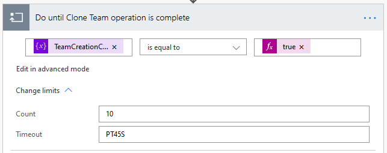

16. Inside the Do until action: add a `Delay [Schedule]` action for 45 seconds

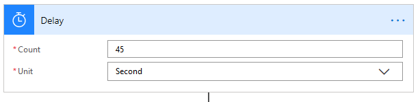

17. Inside the Do until action: add a `HTTP [HTTP]` to check if the operation completed using the Location value returned to us in the Clone action

Method: `GET`

URI: `https://graph.microsoft.com/v1.0@{body('Parse_JSON_of_response')?['Location']}`

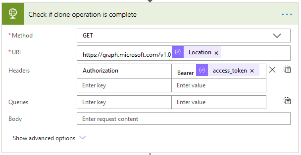

18. Inside the Do until action: add a `Parse JSON [Data Operations]` to parse the `Body` of the HTTP call

Content: ```@{body('Check_if_clone_operation_is_complete')}```
Schema: 
```
{
    "type": "object",
    "properties": {
        "id": {
            "type": "string"
        },
        "operationType": {
            "type": "string"
        },
        "createdDateTime": {
            "type": "string"
        },
        "status": {
            "type": "string"
        },
        "lastActionDateTime": {
            "type": "string"
        },
        "attemptsCount": {
            "type": "integer"
        },
        "targetResourceId": {
            "type": "string"
        },
        "targetResourceLocation": {
            "type": "string"
        },
        "error": {}
    }
}
```

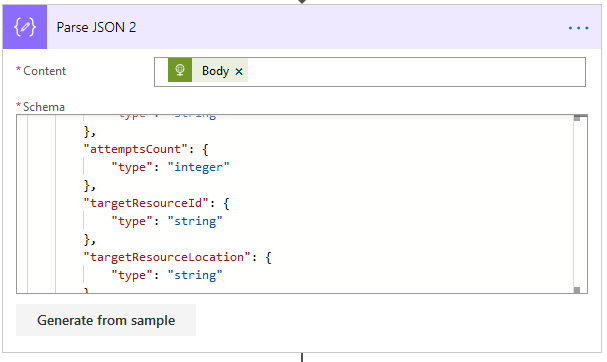

19. Inside the Do until action: add a `Set variable [Variables]` action to set `TeamCreationStatus` to the `status` from the parse action

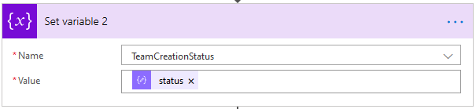

20. Inside the Do until action: add a `Switch [Control]` action on the `TeamCreationStatus` variable. Add Cases for `succeeded` and `failed`, setting the `TeamCreationCompleted` variable to `true` in each

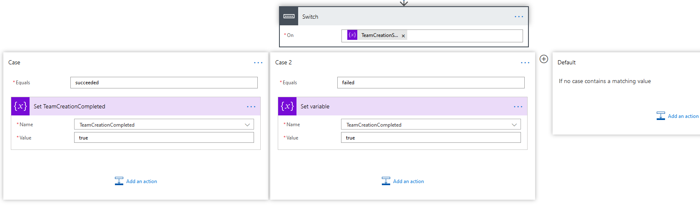

21. AFTER the Do until action: add a `Condition [Control]` action to check if the `TeamCreationStatus` variable `is not equal to` `succeeded`. If it is, terminate and handle the failure (like send someone a message or something, which is not included in this example)

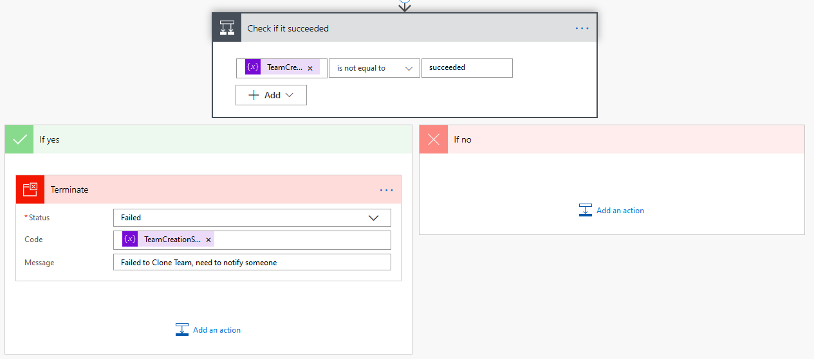

22. Add a new step using the `HTTP [HTTP]` action (notice the space in between Bearer and the access token in the Headers) to Update the Team with the appropriate AllowGuests setting

Method: POST

URI: ```https://graph.microsoft.com/v1.0/groups/@{outputs('Strip_Team_ID_from_Location_Response')}/settings```

Headers: Authorization: ```Bearer @{body('Parse_JSON')?['access_token']}```

Body:
```
{
  "displayName": "Group.Unified.Guest",
  "templateId": "08d542b9-071f-4e16-94b0-74abb372e3d9",
  "values": [
    {
      "name": "AllowToAddGuests",
      "value": "@{variables('AllowGuests')}"
    }
  ]
}
```

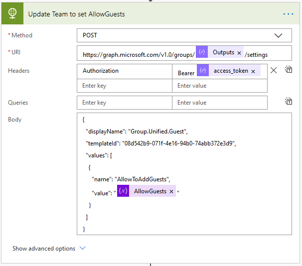

23. Add a new step using the `HTTP [HTTP]` action (notice the space in between Bearer and the access token in the Headers) to add the Owner to the new team

Method: POST

URI: ```https://graph.microsoft.com/v1.0/groups/@{outputs('Strip_Team_ID_from_Location_Response')}/owners/$ref```

Headers: Authorization: ```Bearer @{body('Parse_JSON')?['access_token']}```

Body: (if you get an error when saving after this, add another @ symbol in front of @odata.id)
```
{
  "@odata.id": "https://graph.microsoft.com/v1.0/users/@{body('Get_Owner_ID')?['id']}"
}
```

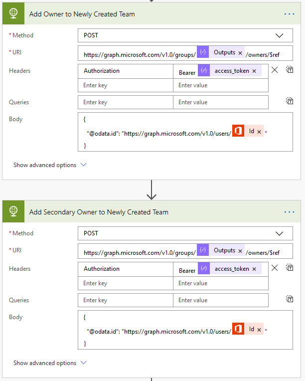

24. Add a new step using the `HTTP [HTTP]` action (notice the space in between Bearer and the access token in the Headers) to add the Secondary Owner to the new team

Method: POST

URI: ```https://graph.microsoft.com/v1.0/groups/@{outputs('Strip_Team_ID_from_Location_Response')}/owners/$ref```

Headers: Authorization: ```Bearer @{body('Parse_JSON')?['access_token']}```

Body: (if you get an error when saving after this, add another @ symbol in front of @odata.id)
```
{
  "@odata.id": "https://graph.microsoft.com/v1.0/users/@{body('Get_Secondary_Owner_ID')?['id']}"
}
```

25. Add a `Update item [SharePoint]` action to update the TeamId field. We're done, so let's update the request item so we can track requests to teams (and maybe status). For each required field, set it to the same field from the trigger action. Set the TeamId to `@{outputs('Strip_Team_ID_from_Location_Response')}`

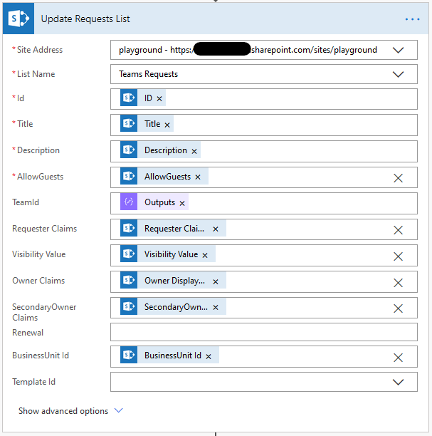

25. Add a `Post a message as the Flow bot to a user (preview) [Microsoft Teams]` action to let the requester know we're all done.

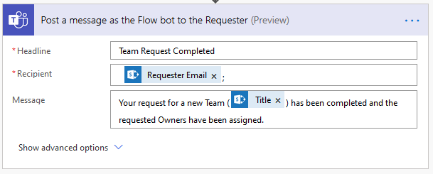

TODO: SharePoint Online Site Design

Follow Michael's instructions in his **But Let's Not Forget SharePoint** step here: https://medium.com/@michael.mukalian/automating-the-provisioning-of-selective-teams-with-guest-access-part-3-microsoft-power-automate-bae61f7a759a

## Or import the Power Automate Flow
Follow this step if you want to import the flow and fix it up rather than create the flow from scratch above.

1. Browse to https://flow.microsoft.com
2. Click on `My flows`
3. Click `Import`
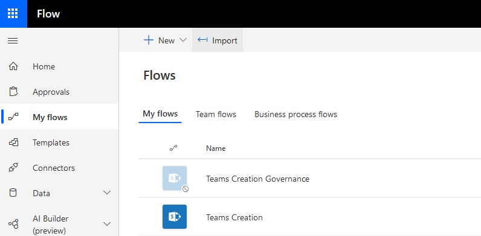
4. Download [TeamsCreationGovernance.zip](/TeamsCreationGovernance.zip) and upload your copy of this file
5. After importing, edit the Flow to plug in your IDs for the AAD Application, your SharePoint Online site and lists, etc.
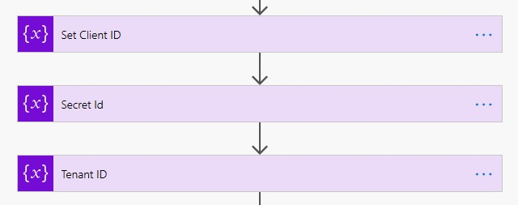
6. Alter this Flow to meet your needs, including populating the Renewal field, setting the External Sharing attribute for the Team, etc.

## Create PowerApp
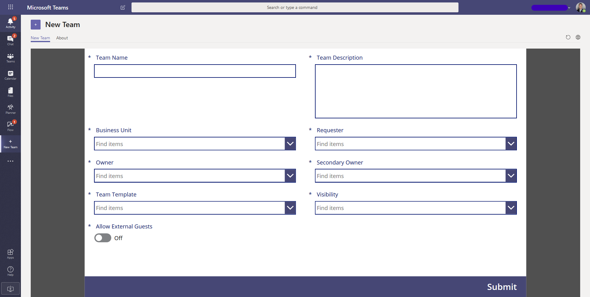
1. Download [New Team.msapp](/New%20Team.msapp)
2. Browse to https://make.powerapps.com
3. Click on `New app` > `Canvas`
4. Click `Open` and browse to your downloaded .msapp file
5. Once the app opens, click `View` > `Data sources`
6. Delete the `Teams Requests` SharePoint connection
7. Search for `SharePoint` and add a connection to your SharePoint `Teams Requests` list (make sure it is named the same)
8. Test it to make sure it is working
9. Save and Publish it

## Publish PowerApp to Teams and Pin
1. Add your PowerApp to Teams: https://docs.microsoft.com/en-us/powerapps/maker/canvas-apps/embed-teams-app
2. Publish it in your tenant's app catalog: https://docs.microsoft.com/en-us/microsoftteams/tenant-apps-catalog-teams
3. Pin your app to the sidebar in Teams: https://docs.microsoft.com/en-us/microsoftteams/teams-app-setup-policies

*Note: this can take a while to show up